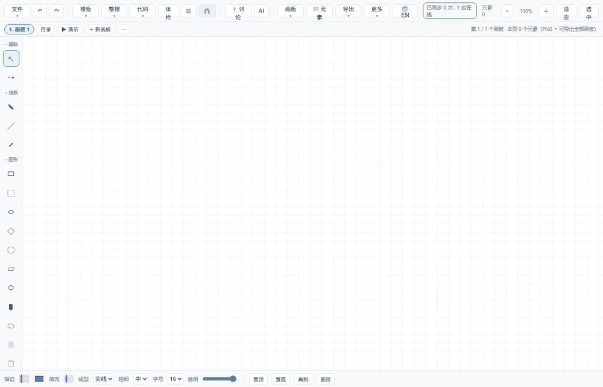
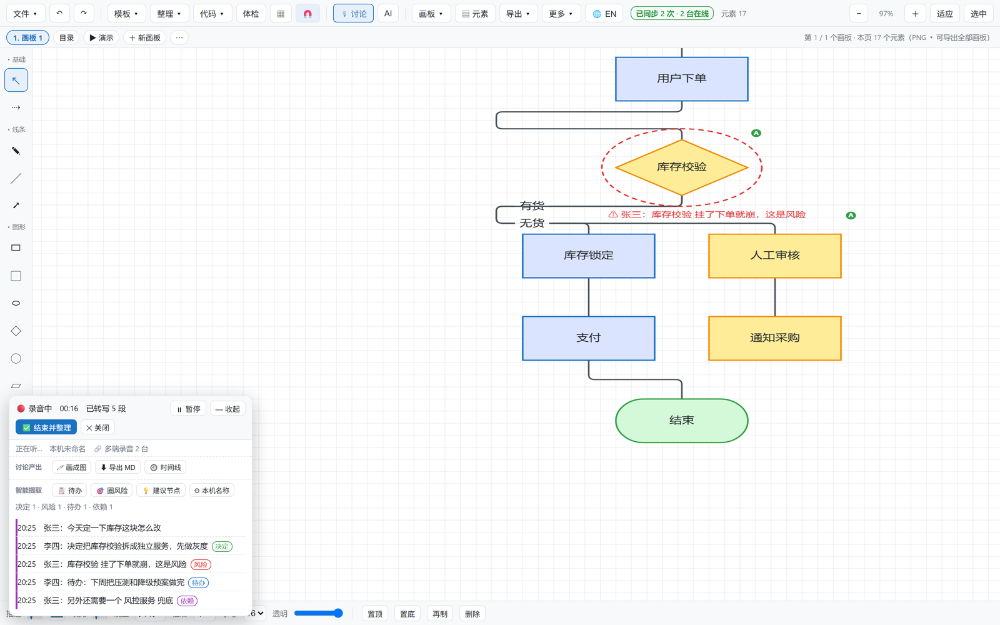

# AI 白板

> **中文** ｜ [English](README.en.md)

[](https://github.com/ccjianxing/ai-whiteboard/actions/workflows/ci.yml)
&nbsp;Python 3.8+ &nbsp;·&nbsp; MIT &nbsp;·&nbsp; 零依赖（纯标准库）

**一块你和你的 AI agent 共用的白板。**

不是"又一个带 AI 的画图工具"——而是：**一个人主用，他自己的 agent 加入画板**。
你在白板上说话，就是在跟自己的 agent 对话；agent 画的、改的、圈的，都落在同一块板上。

- 单文件前端：`board.html`（原生 JS，无框架、无构建、零外链）
- 零依赖后端：`server_v2.py`（**纯 Python 标准库**，不用 pip 装任何东西）
- 给 agent 的接口：`mcp_server.py`（标准 MCP；也可以让 agent 只访问一个网址自助入驻）

---



*演示（无音频的脚本化录制）：讨论模式里边听边转写、自动标出**决定 / 风险 / 待办**；点「🎯 圈风险」把风险圈到图上对应元素；点「💡 建议节点」列出"讨论里提到、图上还没有"的节点。*

---

## 它和别的白板不一样在哪

| | 一句话 |
|---|---|
| 🎙 **开会就出方案** | **讨论模式**一边听一边转写、自动标出关键内容，结束一键整理成方案、画成流程图、抽出待办。**别人给你的是白板，这里给你的是"会议 → 图 → 待办"的整条流水线。** |
| 🤖 **你的 agent 驻扎在同一块板上** | 它不用在你机器上装任何东西 —— 访问一下 `http://<你的白板>/join.md` 就入驻了。你在板上说话它听得到，它画的元素带**绿底 A 角标**。 |
| 📄 **把方案丢进来就出图** | 把 `.md/.txt/.json` 直接拖进输入框，AI / agent 先读完再照着画；长方案按行分段读，不撑爆上下文。 |
| 👥 **多人同时画不打架** | 不是整块覆盖，而是**按元素合并**：各画各的互不覆盖，删掉的东西不会被别人推回来，撞车了会提示。 |
| 🧩 **零依赖自托管** | 单文件前端 + 纯标准库后端，`python server_v2.py` 就跑，Python 3.8 也能跑；要不要内置 AI 由你决定。 |

## 讨论模式：从"嘴"到"图"的一条流水线

这是这个项目最花心思的部分 —— 它想解决的是**"会开完了，图没人画、待办没人记"**。

点顶栏「讨论」开始，剩下的它自己来：

| 步骤 | 它做什么 |
|---|---|
| 1️⃣ **边听边转写** | 麦克风录音 → 服务端识别 → 面板里逐条出现，带时间与说话人。静音 1.8 秒自动收段，可随时暂停；面板可**最小化成小胶囊**，不挡画布。 |
| 2️⃣ **自动分说话人** | 每段语音提取音色特征（基频 / 频谱质心 / 过零率）在线聚类，自动分出最多 4 个说话人，名字可点着改。 |
| 3️⃣ **多设备同场** | 每台设备一轨，转写汇总到同一块板；还会交叉校验并提示"**这台设备上不止一个人**""**这两台设备音色很接近，可能是同一个人**"。 |
| 4️⃣ **关键内容自动标记** | 实时扫五类词，彩色标签直接标在转写旁边：🟢 决定 ｜ 🔴 风险 ｜ 🔵 待办 ｜ 🟠 问题 ｜ 🟣 依赖。 |
| 5️⃣ **图形时间线** | 从打开讨论模式起，**画布每改一步都记一条**（带快照）。可以点任意一条**回放**到那一刻，甚至边回放边播当时那段录音。 |
| 6️⃣ **结束并整理** | 一键把「转写 + 图形变化 + 当前画布 + 上下文」交给 AI → 出一份**方案**（可复制 / 直接写成新画板），并**自动抽出待办清单**。 |

整理完之后，四个一键动作：

| 按钮 | 作用 |
|---|---|
| 🖊 **画成图** | 把讨论结论画成一张流程图（新画板） |
| 🎯 **圈风险** | 把讨论里标记到的**风险/问题**自动圈到画布上对应的元素 |
| 💡 **建议节点** | 列出"**讨论里提到了、但图上还没有**"的节点（文本相似度比对），提醒你图没画全 |
| ⬇ **导出 MD** | 一份 Markdown：方案 + 完整转写 + 图形时间线 + 画板截图 |

> 典型用法：**需求评审 / 故障复盘 / 方案讨论**。开着讨论模式，白板上同步画；散会时你手里已经有方案、有图、有带负责人的待办。
>
> 

## 30 秒上手

```bash
python server_v2.py
# 打开 http://127.0.0.1:9091/board.html
```

就这样。**不需要 API key、不需要装依赖。**

此时白板处于「**纯 agent 模式**」：内置 AI 不参与，等你的 agent 接进来。

## 让你的 agent 自己入驻（推荐）

**不用读文档、不用配文件 —— 让 agent 去访问一下这个网址就行。**

白板把自己"怎么加入"发布在网上，agent 访问后就能自助入驻：

| 访问 | 得到什么 |
|---|---|
| `GET /` 或 `/board.html` | 画板页面（人看的） |
| `GET /.well-known/agent.json` | **机器可读清单**：MCP 地址、HTTP 接口、入驻说明链接 |
| `GET /join.md` 或 `/llms.txt` | **入驻说明**（markdown，agent 读了就知道一步步怎么做） |
| `POST /mcp` | **MCP over HTTP** —— 支持 MCP 的 agent 直接连这里，**本地不需要放任何文件** |

**给 agent 的那一面中英双语**：`/join.md?lang=en`、`/.well-known/agent.json?lang=en` 给英文，
MCP 的 `/mcp?board=<板号>&lang=en` 与 stdio 方式的 `WB_LANG=en` 会给**英文工具说明**
（46 + 3 + 2 个工具的说明是 agent「挑哪个工具」的依据，英文模型读英文说明更准）。不加参数就是中文。

举个例子：agent 拿到 `http://<服务器>:<端口>/join.md`，按里面三步就能开始工作：

```
POST /api/agent/hello   {"name":"你的名字"}          ← 报到，用户会在画板上看到你
POST /api/chat/wait     {"since":0,"timeout":50}     ← 听用户说话
POST /api/chat/push     {"who":"你的名字","text":"..."} ← 回话
```

画板工具清单：`GET /api/tools`（46 个）；调用：`POST /api/agent/call {"tool":..., "args":{...}}`。

> 连 `/join.md` 和 `/.well-known/agent.json` 都是**不需要令牌**的 —— 内网放开时直接可读；
> 需要令牌的部署，agent 会从清单里看到要带 `X-WB-Token`。

## 把你的 agent 接上（MCP，本地文件方式）

在 MCP 客户端里加一段配置：

```json
{
  "mcpServers": {
    "ai-whiteboard": {
      "command": "python",
      "args": ["/绝对路径/mcp_server.py"],
      "env": { "WB_AGENT_NAME": "我的助手" }
    }
  }
}
```

agent 一连上，白板面板顶部就会出现：

```
🤖 我的助手 已接入 —— 你在这里说话就是跟它对话
```

之后：

- **你在白板里打字** → 消息进入共享对话 → agent 用 `board_chat_wait` 听到 → 用 `board_chat_say` 回应 → 你直接看到
- **agent 调 46 个画板工具** → 画流程图/架构图/时序图、增删改元素、连线、自动布局、圈注、导出、多画板、演示、回放……

MCP 一共暴露 **51 个工具**（46 个画板工具 + 3 个对话工具 + 2 个附件工具）。

> ⚠️ 画板类工具的执行发生在浏览器里（用的是页面里的真实画布），所以**要有一个开着的 `board.html`**。
> 对话类与附件类工具不需要 —— 它们直接存在服务端，没人开着页面也能留言、也能读方案。

## 想用内置 AI？（可选）

不接 agent 时，白板也能自带一个 AI 陪你画。复制配置再填 key：

```bash
cp ai_config.example.json ai_config.json   # 然后填 api_key
```

**不填也完全不影响使用**，只是没有内置 AI。

## 功能一览

| 能力 | 说明 |
|---|---|
| **讨论模式** | 见上面那一整节：转写 / 分说话人 / 多设备 / 关键内容标记 / 图形时间线与回放 / 一键整理成方案 + 画成图 + 圈风险 + 建议节点 + 导出 MD |
| 画图 | 33 种形状（流程/架构/时序/泳道/类图/表格/队列/防火墙/浏览器…）、手绘、连线、自动布局、对齐分布 |
| 多画板 | 画板管理与切换、跨板引用（框里实时显示别页内容）、对比、演示模式 |
| 画板管理 | 画板栏标签**右键**就有：重命名 / 复制 / 删除 / 前移 / 后移 / 移到最前 / 移到最后 / 从这页演示 / 导出这页 PNG；**删除可撤销**；`Alt+1..9` 快速切画板 |
| 工具栏分组 | 左栏按类型分成 **6 组**（基础 / 线条 / 图形 / 流程 / 结构 / 其他），**每组可折叠**（状态记住） |
| 元素面板 | 顶栏「▤ 元素」：当前画板元素**按类型分组**（多的在前）、**每组可折叠**，点条目选中并定位过去，点数量选中整组 |
| 网页审阅 | 把网页截成整页图贴到画板，直接在图上圈注；AI/agent 能看到你说的每个标记 |
| 传文件给 AI | 对话里点 📎 或把文件**直接拖进输入框**：AI/agent 先读你的方案（md/txt/json/csv…）再照着画；支持按行分段读长方案，单份 40 万字 |
| 历史不丢 | **对话、讨论转写、上传的方案都按板落盘**（`chat.json` / `disc.json` / `docs.json`）—— 服务重启、换台设备打开，历史都还在 |
| 协作 | 多人实时共享同一块画板（`?board=xxx` 链接分享），**元素级合并：各画各的互不覆盖** |
| 账号 | 注册/登录 → 每个人一块自己的白板，**你的 agent 就驻扎在那块板上**；邀请链接拉人协作 |
| 语音 | 麦克风 → 服务端识别（**需要 HTTPS**）；**服务端识别不可用时（比如网关额度用尽）自动用浏览器自带识别顶上，并在界面上写清这句是"浏览器识别"** |
| 导出 | PNG / SVG / PDF / JSON / Mermaid / PlantUML |

### 多人一起画为什么不打架

同一块板上多人同时动手时，**不是整块覆盖，而是按元素合并**：

- 前端只把「自己改过的那几个元素」推上去（内容指纹比对，不用在每处改动点埋钩子），带一个改动时刻；
- 服务端逐元素比时刻：谁新谁赢；删除用**墓碑**记录，删掉的东西不会被别人再推回来；
- 两端各自"还没推上去的改动"会被保留并重推 —— 不会出现"我刚画的被别人的同步冲掉"；
- 两个人同时改**同一个**元素时按时刻定胜负，并在界面提示"有 N 处改动撞上了"，不静默丢。

不同的板互不可见：agent 归属、对话、附件、工具调用都按板隔离；`?board=` 为空按 `default` 板算（**不做通配**）。

## 一个人主用 + 他的 agent（推荐用法）

这套东西的设计前提是：**一个人主用一块板，他的 agent 就驻扎在那块板上**，他其实是在跟自己的 agent 对话。

1. 打开白板 → 顶栏 👤 → **注册**一个账号（用户名 + 密码）。
2. 你会得到一块**属于自己的板**（板号跟着账号走），别人看不到、也不会串。
3. 让 agent 入驻：点 👤 面板里的「邀请别人」拿到地址，或直接把
   `https://<服务器>:9443/join.md?board=<你的板号>` 丢给你的 agent —— 它自己就会接上。
4. 之后你在白板上说的、画的、圈的，agent 都能看到；它画的也会出现在你眼前。
5. 别人要一起看/一起画：把**邀请链接**发给他（`?board=<你的板号>`），他打开就进了你这块板。

> 语音输入需要 HTTPS：局域网直连请用 `https://<服务器>:9443/board.html`（自签证书，浏览器点一次"继续访问"）。
> HTTP 下 `navigator.mediaDevices` 是 `undefined` —— 这是浏览器硬规则，页面会提示并给一键切换。

## 部署到服务器

```bash
PORT=9091 python server_v2.py      # 监听 0.0.0.0
```

- **访问令牌**：三种策略，用环境变量选（服务端首次启动会生成 `wb_token.txt`，启动日志里也打印）：

  | 环境变量 | 行为 | 适合 |
  |---|---|---|
  | （都不设） | 非本机一律要令牌，页面按需弹一次输入框 | **公网部署**（安全默认） |
  | `WB_TRUST_LAN=1` | 私有地址（192.168./10./172.16-31.）**免令牌**，只有外网来源才要 | **内网团队共用**（打开就能用，不用输令牌） |
  | `WB_NO_TOKEN=1` | 完全不要令牌 | 完全可信的隔离网络 |

  分享链接可以带令牌：`http://<服务器>:<端口>/board.html?token=<令牌>`，对方打开直接进，不用手输。
- 对外建议用 Nginx/Caddy 反向代理 + HTTPS，别把端口直接暴露公网。
- Docker：

```bash
docker build -t ai-whiteboard .
docker run -p 9091:9091 ai-whiteboard
```

> 容器里没有 Edge/Chrome，「网页截图」功能不可用（会明确报错，不影响其它功能）。
> 需要截图就用宿主机直接跑，或自己装 chromium。
>
> **状态文件写在代码目录里**（`sync_state.json` 协作画布、`todos.json` 待办、`wb_token.txt` 令牌），
> 想让它们持久化就把整个 `/app` 挂出来，或者接受容器重建后状态重置。

## agent 侧怎么接（细节）

| 工具 | 用途 |
|---|---|
| `board_chat_wait(timeout)` | **听**用户在白板上说了什么（阻塞最多 120 秒，有消息立刻返回） |
| `board_chat_say` / `board_chat_read` | 说话 / 读对话（都不需要浏览器） |
| `board_doc_list()` | 列出用户**上传的方案/文档**（谁在对话里丢了文件，agent 就能拿到） |
| `board_doc_read(id, from, to)` | 读附件正文，**可按行区间读**（长方案分段读，不要一次塞爆上下文） |
| 其余 46 个 | 画板操作，与内置 AI 用的是**同一份定义** |

工具清单直接从 `server_v2.py` 的 `WB_TOOLS` 解析，**不另维护一份** ——
避免"实现了却忘了告诉 AI"这类漂移。

> agent 那台机器上**只需要 `mcp_server.py` + `wb_token.txt` 两个文件**：
> 本地没有 `server_v2.py` 时，它会自动向服务端 `/api/tools` 要工具清单。

## 项目结构

这个仓库只有跑起来必需的东西：

```
board.html          单文件前端（含全部 CSS/JS，无框架、无构建）
server_v2.py        后端（纯 Python 标准库；同步、账号、对话、讨论、待办、附件、MCP 桥、内置 AI 调用）
mcp_server.py       MCP 服务器（把白板能力暴露给任意 agent；本地不需要放其它文件）
截图.js             CDP 整页截图（网页审阅功能用；需要本机有 Chrome/Edge）
ai_config.example.json   配置模板（复制成 ai_config.json 填你自己的 key；真配置已被 .gitignore 排除）
Dockerfile / docker-compose.yml  容器化部署
README.md / README.en.md   中英文说明
LICENSE             MIT
.gitignore          把密钥、令牌、画布状态、日志挡在仓库外（**别删**，见文末）
docs/demo.gif       上面的演示动图
docs/board.png      界面静态图
```

## 数据存在哪

服务端（默认就在 `server_v2.py` 同目录，都是普通 JSON，`cp` 走就能备份）：

| 文件 | 内容 | 说明 |
|---|---|---|
| `sync_state.json` | 画布（权威副本） | 元素级合并的基准；浏览器里另有一份 `localStorage['wb2']` 作为本地缓存 |
| `chat.json` | 板上对话 | 按板分桶，每板保留最近 300 条 |
| `disc.json` | 讨论转写 + 时间线 | 按板分桶 |
| `docs.json` | **上传的方案/文档** | 按板分桶，每板最多 20 份、单份 40 万字、**24 小时自动过期** |
| `todos.json` | 待办（含讨论/整理里抽出的） | |
| `users.json` | 账号 | 存的是加盐哈希，别外传 |
| `web_rules.json` | 网页审阅规范 | |

浏览器本地（`localStorage`）：画布缓存 `wb2`、对话/讨论缓存、登录态、语言、折叠状态等偏好。
**换台设备打开同一块板，看到的历史来自服务端** —— 所以服务重启、换电脑都不丢。

> 备份就备服务端这几个 JSON。附件（上传的方案）**故意设了 24 小时过期**：它是"临时丢给 AI 读的料"，
> 不是文档库，别拿它当唯一存档。

## 自己验证它能用

不需要任何测试框架：起服务 → 打开页面 → 画两笔 → 让 agent 接一下。

```bash
curl -s http://127.0.0.1:9091/api/health              # 服务活着、报告能力（模型/视觉/语音/形态）
curl -s http://127.0.0.1:9091/api/tools | head -c 200 # 46 个画板工具的清单
curl -s http://127.0.0.1:9091/join.md | head -20      # agent 读的入驻说明（它照着做就能接上）
```

**不要**让这些文件被浏览器直接取到 —— 这一条请自己确认一次（把 `<端口>` 换成你的）：

```bash
for p in ai_config.json wb_token.txt users.json wb.key server_v2.py; do
  echo -n "/$p -> "; curl -s -o /dev/null -w '%{http_code}\n' http://127.0.0.1:<端口>/$p
done
# 期望：全部 404
```

> 为什么专门写这一条：服务端基于 `SimpleHTTPRequestHandler`，它的默认行为是**把工作目录下任何文件发出去**。
> 本项目 1.0.4 起改成静态**白名单**（只发页面 `/board.html`、`/` 与截图 `docs/board.png`），并且不再生成目录清单。
> 如果你自己改动了静态文件那段逻辑，请务必重跑上面的检查。

## 语言现状（说实话）

- **给 agent 的那一面**：中英双语（入驻说明、清单、51 个工具说明）—— 见上，`?lang=en`。
- **文档**：README 中英两版（`README.md` / `README.en.md`）。
- **界面**：顶栏 **🌐 EN** 一键切换，选择会记住。词表 **843 条**，覆盖按钮、**全部下拉菜单**
  （含模板名与开关状态）、面板标题、下拉选项、悬停提示、同步条 / agent 条 / 输入框提示等动态文案。
- **仍是中文的部分**：少数长帮助文本（悬停才看到的整段说明）、罕见 toast 与边界错误、服务端返回的错误信息。
  语言表的键就是"中文原文"，**没翻到的保持中文，不会变空白**。
- **默认中文，不自动跟随浏览器语言**：默认值必须确定，否则截图基线与自动化会随环境漂移。要英文点顶栏 EN。

> 想补齐剩下的长尾文案，欢迎 PR：把中文原句加进 `board.html` 里的 `EN` 词典即可（键就是中文原句）。

## 安全提醒

- `ai_config.json`（模型 key）与 `wb_token.txt`（访问令牌）**绝对不要提交**，`.gitignore` 里已排除；
  **别删 `.gitignore`** —— 少了它，`git add .` 会把你的密钥和画布状态一起提交上去。
- 服务端写状态文件时按 `0600` 落盘（只有跑服务的用户能读）；你自己放的 `ai_config.json` 也请 `chmod 600`。
- 非本机访问必须带令牌；本机（`127.0.0.1`）免令牌。`WB_TRUST_LAN=1` 只适合**可信内网**。
- **讨论模式的录音会离开你的机器**：转写走你配置的语音网关；服务端不可用时用浏览器自带识别（由浏览器厂商在线识别）。
  界面上会写清是哪一个。
- **静态文件只发白名单**（页面与截图），其余一律 404 —— 这是刻意设计，改这段代码前先读上面的「自己验证」。

## License

MIT
